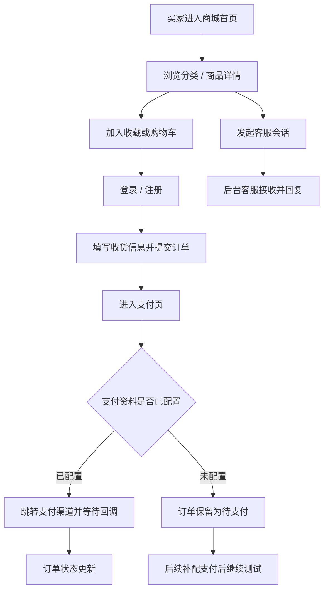
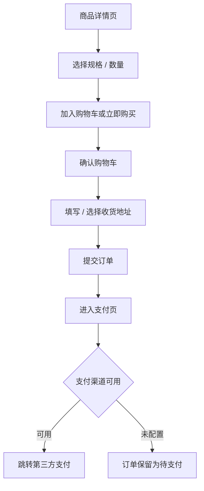
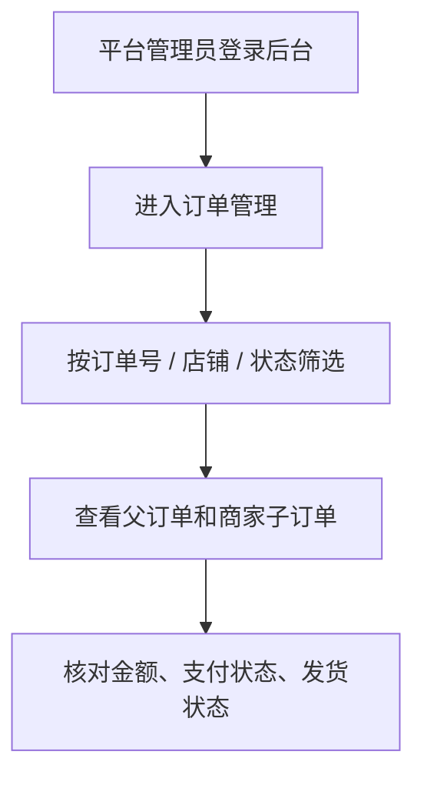
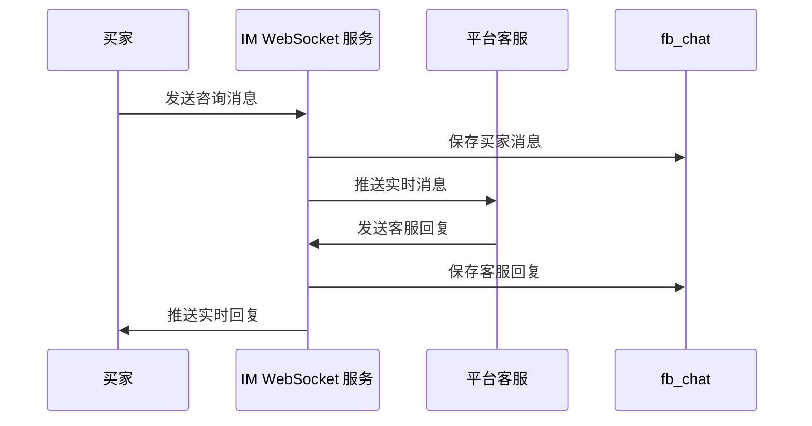
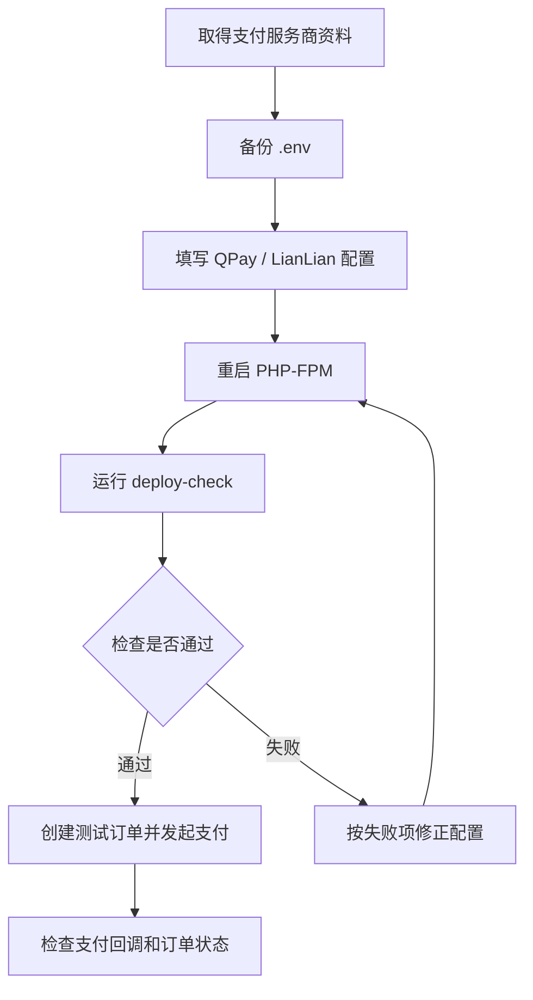

# Mongoyia 2.0 操作教程

适用环境：`https://demo2026.mongoyia.com`

适用版本：`7076f05` 或更新版本

本文面向测试、运营、客服、商家和运维人员。文档不记录真实账号密码、支付密钥、数据库密码或私钥；测试账号和正式账号请向系统管理员获取。

## 1. 角色与入口

| 角色 | 主要入口 | 常用功能 |
| --- | --- | --- |
| 买家 | `https://demo2026.mongoyia.com/` | 浏览商品、注册/登录、购物车、下单、查看订单、收藏/足迹、联系客服 |
| 平台管理员 | `https://demo2026.mongoyia.com/backend/` | 全站订单、商品/分类、商家统计、平台客服、系统信息 |
| 商家/卖家 | `https://demo2026.mongoyia.com/backend/` | 店铺订单、商品数据、商家统计、客服会话 |
| 客服人员 | `https://demo2026.mongoyia.com/backend/mall/kf/index` | 查看会话、接收买家消息、回复买家、标记已读 |
| 运维人员 | 服务器 SSH | `.env` 配置、PHP-FPM/Nginx/IM 服务、部署检查 |

## 2. 总体业务流程



## 3. 买家操作教程

### 3.1 浏览商品

1. 打开商城首页：`https://demo2026.mongoyia.com/`
2. 点击首页分类，例如测试分类：`/mall/category/1`
3. 点击商品进入详情页，例如：`/mall/product/1`
4. 在详情页确认商品标题、价格、库存、规格、客服入口是否显示。

测试环境已验证的商品入口：

- 分类页：`https://demo2026.mongoyia.com/mall/category/1`
- 商品页：`https://demo2026.mongoyia.com/mall/product/1`

### 3.2 登录或注册

1. 点击页面右上角 `Login`。
2. 输入邮箱/账号和密码。
3. 如出现验证码，按页面显示输入验证码。
4. 登录成功后，页面不再显示登录表单，并可进入订单、收藏、足迹等用户中心页面。

常用用户中心入口：

- 个人资料：`/mall/user/setting`
- 我的订单：`/mall/user/order`
- 我的收藏：`/mall/user/favorite`
- 浏览历史：`/mall/user/history`

### 3.3 下单流程



操作要点：

1. 从商品详情页选择商品并加入购物车。
2. 进入购物车确认商品数量和金额。
3. 提交订单前确认收货地址、联系方式、商品金额。
4. 提交后进入支付页。
5. 当前测试服的 QPay/LianLian 真实资料尚未配置，因此订单会保留为待支付状态，这是预期行为。

已验证测试订单：

- 订单号：`202606201052043184`
- 状态：待支付 / 待发货相关状态可在前台订单和后台订单中查看。

### 3.4 联系客服

1. 进入商品页：`/mall/product/1`
2. 点击客服/聊天入口，或直接访问：`/mall/chat/index?gid=1`
3. 页面会自动获取 IM token 并连接 WebSocket：`wss://demo2026.mongoyia.com/ws-im`
4. 输入消息并发送。
5. 后台客服回复后，买家聊天窗口会实时收到回复。

客服链路已验证：

- 买家获取 token 成功。
- WSS 连接成功。
- 买家消息可实时推送到后台客服。
- 后台客服回复可实时推回买家。
- 聊天记录和已读状态可写入数据库。

## 4. 平台管理员操作教程

### 4.1 登录后台

1. 打开后台：`https://demo2026.mongoyia.com/backend/`
2. 输入平台管理员账号和密码。
3. 登录成功后进入后台首页或系统信息页。

常用后台入口：

- 系统信息：`/backend/site/info`
- 平台客服：`/backend/mall/kf/index`
- 商家统计：`/backend/mall/merchant-stat/index`
- 订单管理：`/backend/mall/order/index`

### 4.2 平台订单查看



操作要点：

1. 进入 `/backend/mall/order/index`。
2. 使用订单号、状态、店铺等条件筛选。
3. 核对订单金额、支付状态、发货状态、物流信息。
4. 测试订单会保留在系统中，便于后续验收。

### 4.3 商家统计查看

1. 进入 `/backend/mall/merchant-stat/index`。
2. 查看商品浏览、订单、销售额等统计信息。
3. 对比测试商品和测试订单是否出现在统计中。

### 4.4 平台客服

1. 进入 `/backend/mall/kf/index`。
2. 页面加载后会连接 `wss://demo2026.mongoyia.com/ws-im`。
3. 左侧会话列表显示买家会话和未读数量。
4. 点击会话查看历史。
5. 输入回复内容并发送。

平台客服流程：



## 5. 商家/卖家操作教程

### 5.1 登录商家后台

1. 打开 `https://demo2026.mongoyia.com/backend/`
2. 使用商家账号登录。
3. 登录后进入商家后台视图。

说明：

- 不同账号权限不同，看到的订单、商品、客服会话也不同。
- 平台管理员可以看到平台范围数据。
- 商家账号通常只能看到自己店铺相关数据。

### 5.2 商家订单

1. 进入 `/backend/mall/order/index`。
2. 查看本店订单。
3. 根据订单状态进行后续处理。
4. 若商家账号看不到订单，请确认该账号是否绑定了当前测试店铺。

### 5.3 商家客服

1. 进入 `/backend/mall/kf/index`。
2. 等待 WebSocket 连接成功。
3. 查看会话列表。
4. 回复买家消息。

商家客服和平台客服共用同一套 IM 服务，但权限和会话范围由账号角色决定。

## 6. 支付配置教程

当前 QPay 和 LianLian 的真实支付资料不在后台页面配置，而是在服务器项目根目录 `.env` 中配置。这样可以避免私钥进入数据库或后台页面。

### 6.1 QPay 配置项

在 `/www/wwwroot/demo2026.mongoyia.com/.env` 中配置：

```dotenv
QPAY_AUTH_BASIC=填入服务商提供的 Basic 凭证
QPAY_INVOICE_CODE=填入发票代码
QPAY_AUTH_URL=https://merchant.qpay.mn/v2/auth/token
QPAY_INVOICE_URL=https://merchant.qpay.mn/v2/invoice
QPAY_CALLBACK_BASE=https://demo2026.mongoyia.com
QPAY_CALLBACK_SECRET=自定义回调 secret
QPAY_CALLBACK_HMAC_SECRET=至少 32 位随机字符串
QPAY_CALLBACK_MAX_AGE_SECONDS=300
QPAY_CALLBACK_ALLOWED_IPS=
```

### 6.2 LianLian 配置项

在 `/www/wwwroot/demo2026.mongoyia.com/.env` 中配置：

```dotenv
LIANLIAN_SANDBOX=true
LIANLIAN_MERCHANT_ID=填入商户号
LIANLIAN_SUB_MERCHANT_ID=
LIANLIAN_PUBLIC_KEY=填入连连公钥
LIANLIAN_PRIVATE_KEY=填入商户私钥
LIANLIAN_CALLBACK_BASE=https://demo2026.mongoyia.com
LIANLIAN_CALLBACK_SECRET=自定义回调 secret
LIANLIAN_CALLBACK_HMAC_SECRET=至少 32 位随机字符串
LIANLIAN_CALLBACK_MAX_AGE_SECONDS=300
LIANLIAN_CALLBACK_ALLOWED_IPS=
```

测试环境建议：

- `LIANLIAN_SANDBOX=true`
- 回调域名使用 HTTPS。
- HMAC secret 使用随机字符串，不要使用简单单词。

正式环境建议：

- `LIANLIAN_SANDBOX=false`
- 回调地址确认在支付服务商后台白名单中。
- 配置完成后先跑部署检查，再做小额支付验证。

### 6.3 修改配置后的操作

```bash
cd /www/wwwroot/demo2026.mongoyia.com
cp -a .env .env.bak.payment.$(date +%Y%m%d%H%M%S)
vi .env

/etc/init.d/php-fpm-83 restart

/www/server/php/83/bin/php yii deploy-check/run --profile=test --strict=0 --interactive=0
```

正式上线前执行：

```bash
cd /www/wwwroot/demo2026.mongoyia.com
/www/server/php/83/bin/php yii deploy-check/run --profile=prod --strict=1 --interactive=0
```

支付配置流程：



## 7. IM 服务运维教程

### 7.1 常用命令

```bash
systemctl status mongoyia-im --no-pager
ss -lntp | grep 8767
journalctl -u mongoyia-im -n 120 --no-pager
```

重启 IM：

```bash
systemctl restart mongoyia-im
```

更新 IM 代码后：

```bash
cd /www/wwwroot/demo2026.mongoyia.com
git pull
\cp -f deploy/im-backend/main.py /www/im后端/im后端/main.py
python3 -m py_compile /www/im后端/im后端/main.py
systemctl restart mongoyia-im
```

### 7.2 Nginx 反代要求

`/ws-im` 需要反代到 Python IM 服务端口，例如：

```nginx
location ^~ /ws-im {
    proxy_pass http://127.0.0.1:8767;
    proxy_http_version 1.1;
    proxy_set_header Upgrade $http_upgrade;
    proxy_set_header Connection "Upgrade";
    proxy_set_header Host $host;
    proxy_read_timeout 3600s;
    proxy_send_timeout 3600s;
}
```

## 8. 常见问题

### 8.1 首页能打开，后台 404

检查 Nginx 网站根目录是否指向项目 `web/`：

```nginx
root /www/wwwroot/demo2026.mongoyia.com/web;
```

检查 rewrite 是否包含：

```nginx
location /backend {
    try_files $uri $uri/ /backend/index.php$is_args$args;
}

location /api {
    try_files $uri $uri/ /api/index.php$is_args$args;
}

location / {
    try_files $uri $uri/ /index.php$is_args$args;
}
```

### 8.2 Composer 报缺少 fileinfo/redis

检查 PHP 8.3 CLI 扩展：

```bash
/www/server/php/83/bin/php -m | grep -E "fileinfo|igbinary|redis|json"
```

需要看到：

```text
fileinfo
igbinary
json
redis
```

### 8.3 IM 连接失败

按顺序检查：

```bash
systemctl status mongoyia-im --no-pager
ss -lntp | grep 8767
journalctl -u mongoyia-im -n 120 --no-pager
```

再检查部署配置：

```bash
cd /www/wwwroot/demo2026.mongoyia.com
/www/server/php/83/bin/php yii deploy-check/run --profile=test --strict=0 --interactive=0
```

### 8.4 deploy-check 支付失败项

如果只有 QPay/LianLian 相关失败，且当前还没有服务商资料，这是预期状态。拿到资料后按第 6 节填写 `.env`。

## 9. 验收清单

上线或交付前建议逐项确认：

| 模块 | 检查项 | 预期结果 |
| --- | --- | --- |
| 首页 | 打开 `https://demo2026.mongoyia.com/` | HTTP 200，页面正常 |
| 分类 | 打开 `/mall/category/1` | 显示测试分类和商品 |
| 商品 | 打开 `/mall/product/1` | 商品详情正常 |
| 买家登录 | 买家账号登录 | 进入用户状态 |
| 用户订单 | `/mall/user/order` | 可看到测试订单 |
| 后台登录 | 平台/商家账号登录 | 进入后台 |
| 后台订单 | `/backend/mall/order/index` | 可查看订单列表 |
| 商家统计 | `/backend/mall/merchant-stat/index` | 页面正常 |
| 客服后台 | `/backend/mall/kf/index` | WSS 连接正常 |
| IM 消息 | 买家发消息，客服回复 | 双向实时收发 |
| 支付页 | 从订单进入支付 | 支付渠道显示；未配置资料时不做真实支付 |
| 部署检查 | `deploy-check/run` | 除未配置支付资料外无异常 |

## 10. 资料维护规则

1. 真实 `.env` 不提交 Git。
2. 支付密钥、IM secret、数据库密码不写入文档和聊天记录。
3. 截图如包含账号、手机号、订单隐私或密钥，应先打码。
4. 测试订单、测试商品、测试聊天记录可以保留，便于后续回归测试。
5. 新增账号、权限或支付配置后，应重新跑部署检查和手工验收清单。
